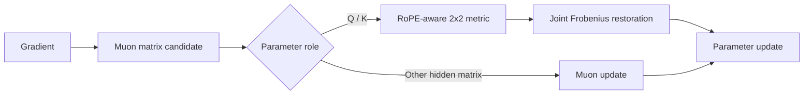

# ORBIT

**Function-Space Optimization for Rotary Query-Key Interactions**

ORBIT is a research optimizer for RoPE-based Transformer language models. It starts from a Muon matrix update, then modifies only the query/key update using a local metric derived from the attention function itself.

The central idea is simple: two matrices with the same shape can play very different roles inside a network. ORBIT uses the known geometry of rotary query-key interactions to make the optimizer aware of that role.

At inference time, ORBIT disappears completely. The trained model has the same parameters and the same forward graph as the underlying Transformer.

**Documentation:** [method](docs/METHOD.md) · [architecture](docs/ARCHITECTURE.md) · [experiments](docs/EXPERIMENTS.md) · [training notes](docs/TRAINING.md)

---

## Installation

From source:

~~~bash
git clone https://github.com/pop123-ux/ORBIT.git
cd ORBIT
pip install -e .
~~~

Development install:

~~~bash
pip install -e ".[dev]"
pytest
~~~

The package requires Python 3.10+ and PyTorch 2.2+.

---

## Quick start

The repository includes a compact RoPE GPT reference model with the hooks ORBIT needs:

~~~python
import torch

from orbit import Orbit, OrbitGPT, OrbitGPTConfig

model = OrbitGPT(
    OrbitGPTConfig(
        n_layer=12,
        n_head=12,
        n_embd=768,
        block_size=512,
    )
)

optimizer = Orbit(
    model,
    lr=0.02,
    adamw_lr=3e-4,
    weight_decay=0.05,
)
~~~

Training is otherwise standard PyTorch:

~~~python
loss = model(x, labels=x).loss
loss.backward()

torch.nn.utils.clip_grad_norm_(model.parameters(), 1.0)
optimizer.step()
optimizer.zero_grad(set_to_none=True)
~~~

A matched Muon control using the same parameter-routing policy is available as:

~~~python
from orbit import Muon

optimizer = Muon(
    model,
    lr=0.02,
    adamw_lr=3e-4,
    weight_decay=0.05,
)
~~~

A small synthetic smoke run is included in [`examples/quickstart.py`](examples/quickstart.py).

---

## Why ORBIT?

For one RoPE frequency pair, the pre-softmax query-key interaction can be written as

$$
s_{ij,f}
=
q_{i,f}^{\top}
R_f(i-j)
k_{j,f}.
$$

Muon gives a strong generic matrix update, but it does not explicitly use this query-key functional structure. ORBIT does.

If query changes by a small perturbation \(\delta q\),

$$
\delta s
=
\delta q^{\top}Rk.
$$

The functional sensitivity of the query update therefore depends on the distribution of the keys, and vice versa. This motivates the opposite-side covariance metrics used by ORBIT.

For each attention head and RoPE frequency pair, ORBIT maintains small \(2\times2\) exponential-moving-average covariance matrices

$$
C_{Q,f}=\mathbb{E}[q_fq_f^\top],
\qquad
C_{K,f}=\mathbb{E}[k_fk_f^\top].
$$

These are transported through the RoPE relative-position rotations:

$$
M_{Q,f}
=
\frac{1}{|\mathcal D|}
\sum_{\Delta\in\mathcal D}
R_f(\Delta)\,
C_{K,f}\,
R_f(\Delta)^\top,
$$

$$
M_{K,f}
=
\frac{1}{|\mathcal D|}
\sum_{\Delta\in\mathcal D}
R_f(\Delta)^\top\,
C_{Q,f}\,
R_f(\Delta).
$$

The default displacement set is

$$
\mathcal D=\{1,2,4,8,16,32,64,128\}.
$$

Muon first produces candidate updates \(U_Q\) and \(U_K\). ORBIT then applies the local inverse-square-root metric:

$$
\widehat U_Q=M_Q^{-1/2}U_Q,
\qquad
\widehat U_K=M_K^{-1/2}U_K.
$$

Finally, one shared factor restores the original combined Q/K Frobenius norm:

$$
\rho
=
\sqrt{
\frac{
\lVert U_Q\rVert_F^2+\lVert U_K\rVert_F^2
}{
\lVert \widehat U_Q\rVert_F^2+\lVert \widehat U_K\rVert_F^2
}
},
$$

$$
\widetilde U_Q=\rho\widehat U_Q,
\qquad
\widetilde U_K=\rho\widehat U_K.
$$

This control is important: ORBIT changes the **geometry** of the Q/K step without winning simply by increasing its total magnitude.

Full derivation and numerical details are in [`docs/METHOD.md`](docs/METHOD.md).

### Update path

Only the Q/K branch adds ORBIT's function-space conditioning.

---

## Relationship to Muon

ORBIT is built around the matrix-update idea introduced by [Muon](https://github.com/KellerJordan/Muon). The public implementation keeps a matched Muon control so the Q/K-specific ORBIT transform can be tested without changing the surrounding parameter-routing policy.

Muon supplies the generic spectral matrix candidate. ORBIT adds a second stage only for RoPE query/key projections:

$
\text{Muon matrix candidate}
\;\longrightarrow\;
\text{RoPE-aware Q/K metric transform}
\;\longrightarrow\;
\text{joint norm restoration}.
$

The original Muon implementation and write-up are useful background:

- [KellerJordan/Muon](https://github.com/KellerJordan/Muon)
- [Muon: An optimizer for hidden layers in neural networks](https://kellerjordan.github.io/posts/muon/)
- [RoFormer / RoPE](https://arxiv.org/abs/2104.09864)

ORBIT should therefore be read as a function-aware extension of a Muon-style matrix update, not as a replacement for the entire optimizer stack.

---

## Parameter routing

ORBIT is not applied indiscriminately to every tensor.

| Parameter class | Update |
| --- | --- |
| Query / Key projections | Muon candidate + ORBIT preconditioning |
| Other hidden 2-D matrices | Muon |
| Token embeddings / tied LM head | AdamW with decay |
| Biases / norms / vectors | AdamW without decay |

This follows the same basic design principle used by Muon-style optimizers: matrix-valued hidden weights use a spectral update, while parameters that are not natural matrix targets remain on an AdamW path.

---

## Primary matched result

The main controlled comparison used a 124M-parameter RoPE GPT-style decoder on FineWeb-Edu. Muon and ORBIT were presented with the same ten candidate hyperparameter configurations and independently selected the same configuration before evaluation on ten new paired seeds.

| | Muon | ORBIT |
| --- | ---: | ---: |
| Mean validation loss | 5.4951 | **5.4887** |
| Mean wall-clock time | 802.9 s | 859.3 s |
| Peak allocated CUDA memory | 4.710 GB | 4.700 GB |

Paired ORBIT-minus-Muon result:

$$
\Delta L
=
-0.006396\ \text{nats},
\qquad
95\%\ \mathrm{CI}
=
[-0.009838,\,-0.002955].
$$

ORBIT achieved the lower validation loss on **9 of 10 held-out paired runs**.

The measured training-time overhead was approximately **7%** in this setting. Peak allocated CUDA memory was effectively unchanged, and ORBIT adds **no inference-time computation**.

The matched experiment is the primary result because optimizer and hyperparameter recipe are held fixed. Broader independently tuned comparisons are useful context, but they mix optimizer effects with recipe effects.

See [`docs/EXPERIMENTS.md`](docs/EXPERIMENTS.md) for the ablations and transfer runs.

---

## Mechanism variants

The optimizer exposes the controls used to isolate the mechanism:

~~~python
Orbit(model, variant="orbit")           # full method
Orbit(model, variant="orbit_norope")    # remove RoPE transport
Orbit(model, variant="orbit_diag")      # remove off-diagonal 2x2 coupling
Orbit(model, variant="orbit_identity")  # collect stats, no preconditioning
~~~

These variants separate generic function-aware Q/K conditioning, the additional contribution of RoPE-relative-position transport, and the smaller contribution of full two-dimensional coupling.

---

## Defaults

| Hyperparameter | Default |
| --- | ---: |
| Muon momentum | 0.95 |
| Newton-Schulz steps | 5 |
| Q/K covariance EMA | 0.95 |
| Functional power | 1.0 |
| Metric regularizer | \(10^{-5}\) |
| Metric condition cap | 100 |
| Relative-position offsets | \(1,2,4,8,16,32,64,128\) |

The learning rate and weight decay should still be tuned for the training setup. Reference settings from the experiments are recorded in [`docs/TRAINING.md`](docs/TRAINING.md).

### Hyperparameter tuning

For the current method, the RoPE displacement grid, functional power, covariance EMA, and condition cap are treated as part of the optimizer definition rather than as extra per-run search dimensions. The main training-recipe parameters to retune are therefore the matrix learning rate, auxiliary AdamW learning rate, and weight decay.

When comparing ORBIT with Muon, use the same candidate space for the shared recipe parameters. The primary experiment in this repository followed that rule so the Q/K preconditioner was not given a larger tuning budget than the baseline.

---

## Implementation

~~~text
ORBIT/
├── src/orbit/
│   ├── optimizer.py       # ORBIT update + closed-form 2x2 metric algebra
│   ├── baselines.py       # matched Muon control
│   ├── model.py           # RoPE GPT reference model and Q/K statistics
│   └── __init__.py
├── examples/
│   └── quickstart.py
├── configs/
│   └── orbit.json
├── docs/
│   ├── METHOD.md
│   ├── ARCHITECTURE.md
│   ├── EXPERIMENTS.md
│   └── TRAINING.md
├── tests/
│   ├── test_orbit.py
│   └── test_muon_control.py
├── pyproject.toml
├── CITATION.cff
└── LICENSE
~~~

The implementation uses closed-form algebra for the symmetric \(2\times2\) inverse metric rather than a general batched eigensolver. This keeps the RoPE-local operation small and avoids constructing a large second-order matrix.

Code-level mapping from equations to functions is documented in [`docs/ARCHITECTURE.md`](docs/ARCHITECTURE.md).

---

## Integrating ORBIT into another RoPE Transformer

The reference model exposes two small hooks:

~~~python
model.orbit_qk_pairs()
model.set_orbit_stat_collection(enabled)
~~~

Each Q/K pair provides the query parameter, key parameter, and an attention module that can return its ORBIT metrics.

The current optimizer also expects the model to expose its token embedding and language-model head as `wte` and `lm_head`, matching the included reference implementation. The interface is intentionally explicit rather than pretending ORBIT is a drop-in optimizer for arbitrary PyTorch models.

For a new architecture, the main integration work is to expose the Q/K projection pairs, collect unrotated Q/K pair covariances during training, implement the same RoPE-relative metric construction, and identify the embedding/head parameters that should stay on the auxiliary AdamW path.

---

## Tests

The test suite covers the pieces that are easiest to get subtly wrong in an optimizer implementation:

- Q/K statistics are disabled by default and enabled by ORBIT;
- RoPE metrics remain positive and position-sensitive;
- the closed-form $2\times2$ inverse metric matches an eigendecomposition reference;
- extreme and repeated spectra stay finite;
- invalid auxiliary metrics fall back locally to identity;
- ORBIT steps change weights without producing non-finite values;
- the identity ablation preserves the statistics path while disabling preconditioning.

Run:

~~~bash
pytest -q
~~~

CI runs the same package tests on every push and pull request.

---

## Research status and scope

ORBIT is research code, not a claim of universal optimizer superiority.

The strongest evidence in the current study is the matched Muon comparison above. Additional experiments include mechanism ablations, a 124M longer-horizon transfer run, and a 355M transfer run. The larger transfer cells use only two seeds and the 355M setting uses a different batch size, so they should not be interpreted as a controlled scaling law.

Current open directions include grouped-query attention, QK normalization, mixture-of-experts architectures, larger pretraining budgets, and reducing the training-time overhead of the statistics path.

---

## Citation

A machine-readable citation is provided in [`CITATION.cff`](CITATION.cff).

~~~bibtex
@misc{pop2026orbit,
  author = {Alexandru Pop},
  title  = {ORBIT: Function-Space Optimization for Rotary Query-Key Interactions},
  year   = {2026},
  note   = {Research software},
  url    = {https://github.com/pop123-ux/ORBIT}
}
~~~

## License

ORBIT is released under the [MIT License](LICENSE).
